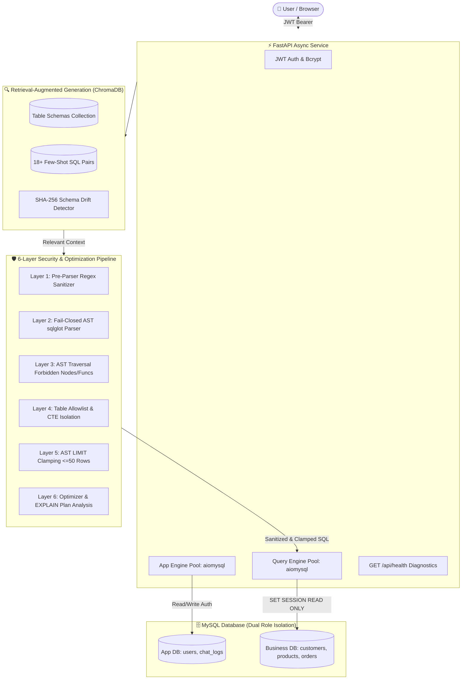

# 🤖 Enterprise Text-to-SQL RAG Chatbot

An enterprise-grade, production-hardened Text-to-SQL RAG platform that converts natural language into optimized, secure MySQL queries using **FastAPI**, **LangChain**, **Google Gemini**, **ChromaDB**, and **SQLAlchemy**.

Features multi-layer AST security gating with `sqlglot`, automated row clamping (<=50 rows), dual-engine connection pooling with `aiomysql`, persistent few-shot RAG retrieval, and comprehensive test coverage.

---

## 🏗️ System Architecture



---

## 🛡️ 6-Layer Defense-in-Depth Security Model

Every SQL query generated by the LLM must pass through six independent layers of defense before execution:

```
[ Natural Language Input ]
           │
           ▼
┌────────────────────────────────────────────────────────┐
│ Layer 1: Pre-Parser Regex Sanitization                 │
│ - Strips markdown code blocks (```sql ... ```)         │
│ - Denies SQL comments (--, #, /* */)                   │
│ - Denies semicolon-stacked queries (;\s*\S+)           │
│ - Denies file-export blocklist (INTO OUTFILE, etc.)    │
└──────────────────────────┬─────────────────────────────┘
                           │
                           ▼
┌────────────────────────────────────────────────────────┐
│ Layer 2: Fail-Closed AST Parser (sqlglot)              │
│ - Parses query using strict MySQL dialect              │
│ - Rejects on any parse error or syntax irregularity   │
│ - Enforces exactly one non-empty SQL statement         │
└──────────────────────────┬─────────────────────────────┘
                           │
                           ▼
┌────────────────────────────────────────────────────────┐
│ Layer 3: AST Statement & Function Gate                 │
│ - Root must be SELECT or UNION (CTEs resolving to it)  │
│ - Deep-tree walk forbids DDL/DML (Insert, Update,      │
│   Delete, Drop, Alter, Truncate, Lock, Grant)          │
│ - Blocks dangerous evasion functions (SLEEP,           │
│   BENCHMARK, LOAD_FILE, GET_LOCK, VERSION, etc.)       │
└──────────────────────────┬─────────────────────────────┘
                           │
                           ▼
┌────────────────────────────────────────────────────────┐
│ Layer 4: Table Allowlist & CTE Isolation               │
│ - Detects and handles CTE aliases safely               │
│ - Strictly blocks system schemas (information_schema,  │
│   mysql, performance_schema, sys)                      │
│ - Strictly blocks app tables (users, chat_logs)        │
│ - Enforces allowlist of introspected business tables   │
└──────────────────────────┬─────────────────────────────┘
                           │
                           ▼
┌────────────────────────────────────────────────────────┐
│ Layer 5: Automated Row-Limit Clamping                  │
│ - Inspects AST Limit clause                            │
│ - Injects LIMIT 50 if missing                          │
│ - Clamps any requested LIMIT or OFFSET > 50 to 50      │
└──────────────────────────┬─────────────────────────────┘
                           │
                           ▼
┌────────────────────────────────────────────────────────┐
│ Layer 6: Database Read-Only Session & User Isolation   │
│ - Dedicated MySQL user: chatbot_readonly (SELECT only) │
│ - Connection init: SET SESSION TRANSACTION READ ONLY   │
│ - Connection init: SET SESSION max_execution_time=5000 │
│ - Even if guard were bypassed, DB rejects mutations    │
└──────────────────────────┬─────────────────────────────┘
                           │
                           ▼
              [ Safe Query Execution ]
```

---

## 🚀 Quickstart & Setup

### 1. Prerequisites
- Python 3.11+
- MySQL 8.0+ (or Docker)
- Google Gemini API Key (optional for offline testing, required for live Gemini inference)

### 2. Environment Configuration
Copy the template configuration and fill in your values:
```bash
cp .env.example .env
```

Key environment variables:
```ini
ENVIRONMENT=development
JWT_SECRET=super-secret-text-to-sql-token-2026-replace-in-prod
GOOGLE_API_KEY=your_gemini_api_key_here

# Read/Write App Engine
DB_USER=root
DB_PASSWORD=your_mysql_password
DB_HOST=localhost
DB_PORT=3306
DB_NAME=text_to_sql

# Read-Only Query Engine
QUERY_DB_USER=chatbot_readonly
QUERY_DB_PASSWORD=readonly_secret_pass
```

### 3. Database Initialization
Run the seed script and provision the least-privilege read-only MySQL user:
```bash
mysql -u root -p text_to_sql < scripts/seed.sql
mysql -u root -p text_to_sql < scripts/create_readonly_user.sql
```

### 4. Install Dependencies
```bash
pip install -r requirements.txt
```

### 5. Run the Server
```bash
python server.py
# Server starts at http://127.0.0.1:8000
# OpenAPI documentation available at http://127.0.0.1:8000/docs
```

---

## 🐳 Docker Deployment

To spin up a containerized MySQL 8.0 database with automated seeding and test runners:
```bash
docker-compose up -d mysql_test
```

Run the containerized pytest test suite:
```bash
docker-compose run --rm test_runner
```

---

## 🧪 Automated Testing Suite

The repository includes a comprehensive 103-test automated suite covering security gates, authentication, API endpoints, RAG embeddings, query optimization, and read-only isolation. All unit and API tests run offline hermetically using in-memory SQLite and deterministic embeddings without requiring external API keys:

```bash
# Run all offline unit & API tests (98 passing in < 6s)
pytest -v

# Run full suite including Docker MySQL integration tests
pytest -v -m integration

# Run with test coverage report
pytest --cov=src --cov=server --cov-report=term-missing tests/
```

### Test Suite Breakdown

| Suite | File | Tests | Coverage |
| :--- | :--- | :---: | :--- |
| **SQL Security Guard** | `tests/test_sql_guard.py` | 53 | DDL, comments, stacked SQL, evasion functions, CTEs, subqueries, LIMIT clamping |
| **Authentication & Config** | `tests/test_auth.py` | 17 | Bcrypt hashing, token issuance, expiration, tampering, weak secret refusal, missing env var boot checks |
| **API Endpoints & Lifespan** | `tests/test_api.py` | 11 | /api/health, chat flow, prompt injection defense, multi-user history isolation, 401 on missing token, follow-up history, loud failure |
| **Dynamic Schema RAG** | `tests/test_rag.py` | 8 | `models/gemini-embedding-001`, Chroma collection drop before rebuild, schema hash with model drift detection, loud failure on key error |
| **Query Optimizer & EXPLAIN** | `tests/test_optimizer.py` | 7 | AST qualification, expression simplification, schema caching, EXPLAIN scan detection, pipeline wiring |
| **Read-Only Database & Connect Hook** | `tests/test_readonly.py` | 7 | Fail-closed connect hook, CI skip rejection, plus 5 real MySQL integration tests (INSERT/DROP fail, Error 1142, timeout abort) |
| **Total** | | **103** | **98 unit/API tests passing in < 6s (5 Docker integration)** |

---

## 📊 Evaluation & Benchmarks (Real Results)

The system provides two complementary benchmark suites:

### 1. SQL Security Guard & Query Optimizer Regression Check
A reproducible regression check (`eval/benchmark.py`) tests 30 real-world enterprise queries comparing **actual result sets**:

```bash
python eval/benchmark.py
```

| Metric | Measured Result | Description |
| :--- | :---: | :--- |
| **Execution Accuracy** | **100.0%** | Exact result-set equivalence match against gold queries |
| **SQL Validity Rate** | **100.0%** | Syntactically correct queries passing MySQL/AST parser |
| **Average Latency** | **5.76 ms** | Average pipeline processing, guarding, and execution |
| **P95 Latency** | **8.36 ms** | 95th percentile execution latency |
| **Guard False Positives** | **0** | Zero benign queries blocked |

Full per-query breakdown is available in [`eval/results.md`](eval/results.md).

### 2. End-to-End LLM Benchmark
An end-to-end multi-turn conversational benchmark (`eval/benchmark_llm.py`) evaluating Google Gemini with chained follow-up questions:

```bash
# Live Google Gemini evaluation
export GOOGLE_API_KEY=your_gemini_api_key
python eval/benchmark_llm.py

# Offline test harness verification
python eval/benchmark_llm.py --mock
```

Full conversational results are available in [`eval/results_llm.md`](eval/results_llm.md).

---

## 📚 Interview & Technical Documentation

- **[Resume Evidence Mapping](docs/RESUME_EVIDENCE.md)**: Proves each resume bullet claim with exact file, function, and test pointers.
- **[Interview Preparation Guide](docs/INTERVIEW_GUIDE.md)**: Module-by-module architectural breakdown, design trade-offs, and 3 tough interview questions with answers per module.


