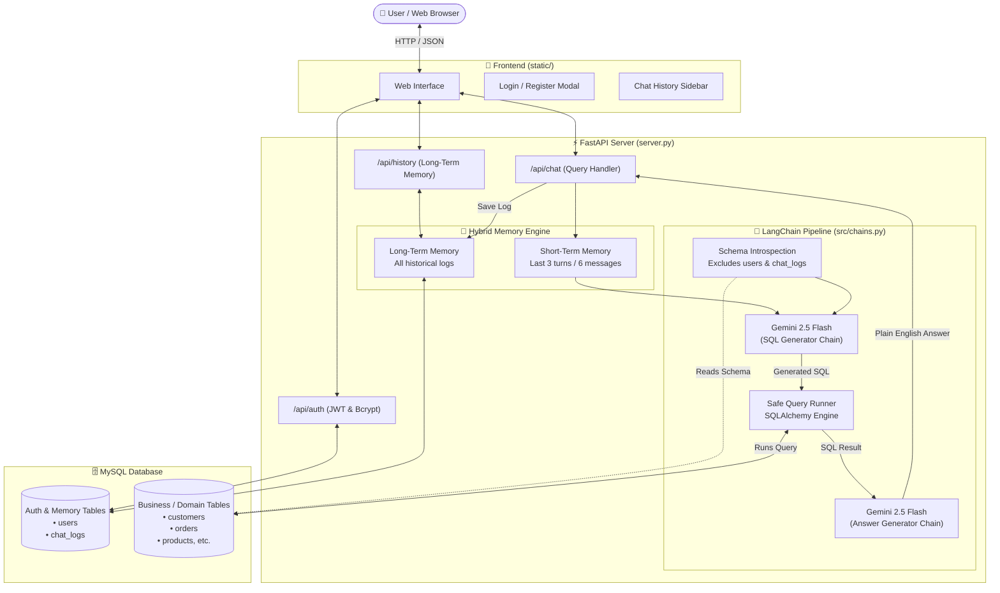

# 🤖 Enterprise Text-to-SQL RAG Chatbot

An intelligent, production-ready AI chatbot that lets you **talk directly to your MySQL database in plain English**. 

Powered by **Google Gemini 2.5 Flash**, **LangChain**, **FastAPI**, and **MySQL**, this application converts natural language questions into accurate SQL queries, executes them safely, and delivers easy-to-understand conversational answers — complete with full user authentication, short-term conversational context, and long-term query history.

---

## 🌟 What Does This Project Do?

Imagine you have a database filled with business data (customers, products, sales, orders). Normally, getting answers requires writing SQL queries:
```sql
SELECT product_name, SUM(price * quantity) AS total_revenue 
FROM orders JOIN products ON orders.product_id = products.id 
GROUP BY product_name ORDER BY total_revenue DESC LIMIT 5;
```

With this chatbot, you can simply type:
> *"Who are our top 5 best-selling products by revenue?"*

The chatbot will:
1. Understand your question and inspect your database schema.
2. Generate the exact SQL query required.
3. Run the query on your MySQL database.
4. Translate the raw data into a friendly, plain English summary while also letting you inspect the generated SQL.

---

## 🚀 Key Features

- 💬 **Natural Language to SQL**: Converts everyday human language into syntactically correct MySQL queries.
- ⚡ **Dual-Chain AI Pipeline**:
  - **SQL Generation Chain**: Analyzes table schemas and user intent to write clean SQL.
  - **Answer Synthesis Chain**: Takes the SQL result and explains the answer conversationally.
- 🧠 **Hybrid Memory System**:
  - **Short-Term Context**: Remembers the last 3 conversation turns (6 messages) so you can ask natural follow-up questions (e.g., *"What about last month?"*).
  - **Long-Term Memory**: Persists every single question, generated SQL query, and answer in the database.
- 🔐 **Multi-User Authentication**:
  - Secure registration and login powered by **bcrypt** password hashing and **JWT** (JSON Web Tokens).
  - Each user has their own private query history and session logs.
- 🛡️ **Schema Isolation & Security**:
  - Internal application tables (`users`, `chat_logs`) are automatically excluded from the AI prompt, preventing Gemini from exposing credentials or private chat data.
- 🎨 **Modern Interactive Web UI**:
  - Clean, responsive dashboard with a dark sidebar, live chat stream, clickable past queries, and visible SQL inspection cards.
- 🚀 **FastAPI Backend**:
  - High-performance asynchronous REST API with auto-generated interactive documentation (`/docs`).

---

## 🏗️ Architecture Diagram

Here is how data flows from the user's browser all the way through the AI chains, the database, and back:



---

## 🔄 Step-by-Step Request Lifecycle

1. **User asks a question** in the web interface (e.g., *"How many orders were placed today?"*).
2. **FastAPI verifies the JWT token** to authenticate the user and retrieve their user ID.
3. **Short-Term Memory Lookup**: The server pulls the last 3 conversation turns from `chat_logs` so the AI understands conversation context.
4. **Schema Introspection**: LangChain inspects the available tables and columns in MySQL (ignoring `users` and `chat_logs`).
5. **Chain 1 (SQL Generation)**: Google Gemini analyzes the question, schema, and chat history, then writes the exact MySQL query.
6. **Query Execution**: The backend executes the SQL query against your MySQL business tables.
7. **Chain 2 (Answer Synthesis)**: Gemini receives the original question, the generated SQL, and the raw query result, formulating a friendly, natural English explanation.
8. **Persistence**: The question, generated SQL, answer, and timestamp are saved to the `chat_logs` table.
9. **Display**: The frontend displays the plain English response along with an expandable raw SQL block.

---

## 💻 Tech Stack

| Component | Technology | Description |
| :--- | :--- | :--- |
| **LLM Provider** | [Google Gemini](https://ai.google.dev/) (`gemini-2.5-flash`) | Fast, state-of-the-art multimodal language model for query generation and synthesis |
| **LLM Framework** | [LangChain](https://www.langchain.com/) | Orchestrates schema reading, prompt templating, and chain execution |
| **Backend API** | [FastAPI](https://fastapi.tiangolo.com/) | High-performance Python web framework for building APIs |
| **ASGI Server** | [Uvicorn](https://www.uvicorn.org/) | Lightning-fast ASGI web server implementation |
| **Database Engine** | [SQLAlchemy](https://www.sqlalchemy.org/) + [PyMySQL](https://pymysql.readthedocs.io/) | Database connectivity, schema introspection, and query execution |
| **Database** | [MySQL 8.0+](https://www.mysql.com/) | Relational database holding business data, user credentials, and chat history |
| **Authentication** | [PyJWT](https://pyjwt.readthedocs.io/) + [bcrypt](https://pypi.org/project/bcrypt/) | Secure password hashing (salted) and stateless token-based authentication |
| **Frontend** | Vanilla HTML5, CSS3, JavaScript | Lightweight, zero-build-step interactive UI with localStorage session caching |

---

## 📁 Project Structure

```text
text-to-sql-rag-chatbot/
│
├── src/
│   ├── auth.py             # Password hashing (bcrypt), JWT creation, and auth verification
│   ├── chains.py           # LangChain definitions for SQL generation and plain-English answers
│   └── database.py         # Database connection, table initialization, and schema exclusion
│
├── static/
│   ├── app.js              # Frontend logic (API requests, chat rendering, sidebar history)
│   ├── index.html          # Web interface HTML layout (Auth modal, Sidebar, Chat area)
│   └── style.css           # Modern, dark-themed responsive styling
│
├── .env.example            # Sample environment configuration template
├── .gitignore              # Files and folders to exclude from version control
├── requirements.txt        # Python package dependencies
├── server.py               # Main FastAPI application entry point
└── README.md               # Project documentation
```

---

## ⚙️ Setup Process (Step-by-Step Guide)

Follow these simple steps to get the project running locally on your computer.

### Prerequisites

Make sure you have the following installed:
1. **Python 3.10+** ([Download Python](https://www.python.org/downloads/))
2. **MySQL Server** (running locally or in the cloud, e.g., via MySQL Workbench, XAMPP, or Docker)
3. **Google Gemini API Key** ([Get a free key from Google AI Studio](https://aistudio.google.com/))

---

### Step 1: Clone the Repository

Open your terminal or command prompt and run:
```bash
git clone https://github.com/Bhumik-47/text-to-sql-rag-chatbot.git
cd text-to-sql-rag-chatbot
```

---

### Step 2: Create a Virtual Environment

It is recommended to use a virtual environment to keep dependencies isolated:

**On Windows (PowerShell):**
```powershell
python -m venv venv
.\venv\Scripts\Activate.ps1
```

**On macOS / Linux:**
```bash
python3 -m venv venv
source venv/bin/activate
```

---

### Step 3: Install Dependencies

Install all required Python packages using `pip`:
```bash
pip install -r requirements.txt
```

---

### Step 4: Set Up Your MySQL Database

1. Open your MySQL client (MySQL Workbench, phpMyAdmin, or MySQL CLI).
2. Create a new database named `text_to_sql`:
   ```sql
   CREATE DATABASE text_to_sql;
   USE text_to_sql;
   ```

3. *(Optional but Recommended)* **Add Sample Data** to test with immediately!  
   Copy and paste this sample store dataset:
   ```sql
   CREATE TABLE categories (
       id INT AUTO_INCREMENT PRIMARY KEY,
       name VARCHAR(50) NOT NULL
   );

   CREATE TABLE products (
       id INT AUTO_INCREMENT PRIMARY KEY,
       name VARCHAR(100) NOT NULL,
       category_id INT,
       price DECIMAL(10, 2) NOT NULL,
       stock_quantity INT DEFAULT 0,
       FOREIGN KEY (category_id) REFERENCES categories(id)
   );

   CREATE TABLE customers (
       id INT AUTO_INCREMENT PRIMARY KEY,
       full_name VARCHAR(100) NOT NULL,
       email VARCHAR(100) UNIQUE NOT NULL,
       city VARCHAR(50) NOT NULL
   );

   CREATE TABLE orders (
       id INT AUTO_INCREMENT PRIMARY KEY,
       customer_id INT NOT NULL,
       product_id INT NOT NULL,
       quantity INT NOT NULL,
       order_date DATE NOT NULL,
       FOREIGN KEY (customer_id) REFERENCES customers(id),
       FOREIGN KEY (product_id) REFERENCES products(id)
   );

   -- Insert Sample Data
   INSERT INTO categories (name) VALUES ('Electronics'), ('Accessories'), ('Office');

   INSERT INTO products (name, category_id, price, stock_quantity) VALUES
   ('MacBook Pro 16', 1, 2499.00, 15),
   ('Dell UltraSharp 27 Monitor', 1, 499.99, 30),
   ('Wireless Mechanical Keyboard', 2, 129.99, 50),
   ('Ergonomic Mouse', 2, 79.99, 80),
   ('Standing Desk Converter', 3, 199.50, 20);

   INSERT INTO customers (full_name, email, city) VALUES
   ('Alice Johnson', 'alice@example.com', 'New York'),
   ('Bob Smith', 'bob@example.com', 'San Francisco'),
   ('Charlie Brown', 'charlie@example.com', 'Chicago');

   INSERT INTO orders (customer_id, product_id, quantity, order_date) VALUES
   (1, 1, 1, '2026-02-15'),
   (1, 3, 2, '2026-02-16'),
   (2, 2, 2, '2026-02-20'),
   (3, 4, 1, '2026-02-25'),
   (3, 5, 1, '2026-03-01');
   ```

> **Note:** You do not need to create `users` or `chat_logs` tables manually. The application creates them automatically when you launch the server!

---

### Step 5: Configure Environment Variables

Create a file named `.env` in the root folder (or copy `.env.example`):

```bash
cp .env.example .env
```

Open `.env` in any text editor and fill in your details:

```ini
# Google Gemini API Key (Get from: https://aistudio.google.com/)
GOOGLE_API_KEY=your_gemini_api_key_here

# MySQL Database Configuration
DB_USER=root
DB_PASSWORD=your_mysql_password
DB_HOST=localhost
DB_PORT=3306
DB_NAME=text_to_sql

# JWT Secret Key (Optional - a default is provided if left blank)
JWT_SECRET=super-secret-key-change-this-in-production
```

---

### Step 6: Run the Application

Start the FastAPI server:

```bash
python server.py
```
*Or using Uvicorn directly:*
```bash
uvicorn server:app --host 127.0.0.1 --port 8000 --reload
```

When started, you will see:
```text
[INIT] Production SQL Chatbot with Auth & Hybrid Memory ready.
INFO:     Uvicorn running on http://127.0.0.1:8000 (Press CTRL+C to quit)
```

---

### Step 7: Open the Web UI

1. Open your web browser and navigate to:
   ```text
   http://127.0.0.1:8000
   ```
2. **Register a new account** (click *"Sign Up"*, enter a username and password).
3. Once logged in, start asking questions about your data!

---

## 💡 Example Questions to Try

If you loaded the sample store data above, try asking:

1. **Simple Queries:**
   - *"How many products do we have in total?"*
   - *"Which product is the most expensive?"*
2. **Aggregation & Grouping:**
   - *"What is the total revenue across all placed orders?"*
   - *"How many customers are located in New York?"*
3. **Table Joins:**
   - *"List all orders with customer names and the products they bought."*
   - *"Who spent the most money in our store?"*
4. **Follow-Up Questions (Context Awareness):**
   - Question 1: *"What products did Alice Johnson purchase?"*
   - Question 2: *"What was the total cost of those items?"*

---

## 📡 API Endpoints

The FastAPI server exposes the following REST endpoints:

| Method | Endpoint | Auth Required | Description |
| :--- | :--- | :--- | :--- |
| `GET` | `/` | No | Serves the frontend single-page application (`index.html`) |
| `POST` | `/api/auth/register` | No | Creates a new user account and returns a JWT token |
| `POST` | `/api/auth/login` | No | Validates credentials and returns a JWT token |
| `GET` | `/api/history` | **Yes** (Bearer Token) | Returns all historical queries and answers for the logged-in user |
| `POST` | `/api/chat` | **Yes** (Bearer Token) | Processes a natural language question and returns the SQL + answer |
| `GET` | `/docs` | No | Interactive Swagger UI API documentation |

---

## 🛡️ Security Best Practices

1. **Schema Sandboxing (`ignore_tables`)**:
   In `src/database.py`, the tables `users` and `chat_logs` are excluded from the LangChain schema introspection. The LLM never knows these tables exist, preventing data leaks of credentials or conversation logs.
2. **Password Security**:
   Passwords are never stored in plain text. They are hashed with a unique salt using `bcrypt`.
3. **Stateless Tokens**:
   Authentication uses standard JWT signed with a secret key, expiring automatically after 7 days.
4. **Recommended Database Permissions**:
   In enterprise production deployments, connect the chatbot using a **Read-Only MySQL User** (`GRANT SELECT ON database.* TO 'chatbot'@'localhost'`) to prevent unintended `UPDATE`, `DROP`, or `DELETE` executions.

---

## 🤝 Contributing

Contributions are always welcome!
1. Fork the repository.
2. Create your feature branch: `git checkout -b feature/AmazingFeature`.
3. Commit your changes: `git commit -m 'Add some AmazingFeature'`.
4. Push to the branch: `git push origin feature/AmazingFeature`.
5. Open a Pull Request.

---

## 📄 License

This project is licensed under the **MIT License** — feel free to use it for personal and commercial projects.
